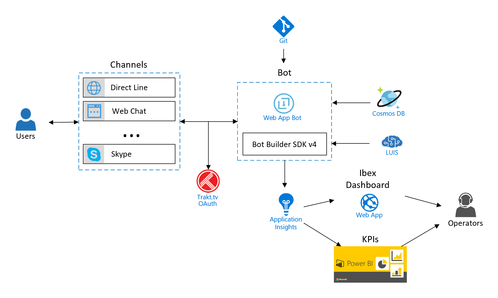

This sample demonstrates a bot to interact with [Trakt.tv](https://trakt.tv/) services. 
It has been developed with [TypeScript](https://www.typescriptlang.org/) & [Azure Bot Service v4](https://docs.microsoft.com/en-us/azure/bot-service/?view=azure-bot-service-4.0). Core folder contains helper files that simplify the development of bots with [Bot Builder SDK v4](https://github.com/Microsoft/botbuilder-js).

You can find a C# version of this sample here: [TraktBotCSharp_V4](https://github.com/magencio/TraktBotCSharp_V4).

## Architecture

## Documentation, SDKs and Tools
- [TypeScript](https://www.typescriptlang.org/)
- [Azure Bot Service v4](https://docs.microsoft.com/en-us/azure/bot-service/?view=azure-bot-service-4.0)
- [JavaScript version of the Bot Builder SDK v4](https://github.com/Microsoft/botbuilder-js)
- [Node.js samples of the Bot Builder SDK v4](https://github.com/Microsoft/BotBuilder-Samples/tree/master/samples/javascript_nodejs)
- [TypeScript samples of the Bot Builder SDK v4](https://github.com/Microsoft/BotBuilder-Samples/tree/master/samples/javascript_typescript)
- [Bot Builder tools](https://github.com/Microsoft/botbuilder-tools)
- [Microsoft Bot Framework Emulator](https://github.com/microsoft/botframework-emulator)
- [IBEX Dashboard](https://github.com/Azure/ibex-dashboard)

## Additional information
This is the specific documentation I used to build this sample:
- [Create a bot with the Bot Builder SDK for JavaScript](https://docs.microsoft.com/en-us/azure/bot-service/javascript/bot-builder-javascript-quickstart?view=azure-bot-service-4.0)
- [Bot configuration with .bot file](https://aka.ms/about-bot-file)
- [Send welcome message to users](https://docs.microsoft.com/en-us/azure/bot-service/bot-builder-send-welcome-message?view=azure-bot-service-4.0&tabs=js%2Ccsharpmulti%2Ccsharpwelcomeback)
- [Persist user data](https://docs.microsoft.com/en-us/azure/bot-service/bot-builder-tutorial-persist-user-inputs?view=azure-bot-service-4.0&tabs=javascript)
- [Manage conversation and user state](https://docs.microsoft.com/en-us/azure/bot-service/bot-builder-howto-v4-state?view=azure-bot-service-4.0&branch=live&tabs=js)
- [Manage simple conversation flow with dialogs](https://docs.microsoft.com/en-us/azure/bot-service/bot-builder-dialog-manage-conversation-flow?view=azure-bot-service-4.0&tabs=javascript)
- [Middleware](https://docs.microsoft.com/en-us/azure/bot-service/bot-builder-concept-middleware?view=azure-bot-service-4.0)
- [Add suggested actions to messages](https://docs.microsoft.com/en-us/azure/bot-service/bot-builder-howto-add-suggested-actions?view=azure-bot-service-4.0&tabs=javascript)
- [Add media to messages](https://docs.microsoft.com/en-us/azure/bot-service/bot-builder-howto-add-media-attachments?view=azure-bot-service-4.0&tabs=javascript)
- [Send an Adaptive Card](https://docs.microsoft.com/en-us/azure/bot-service/bot-builder-howto-add-media-attachments?view=azure-bot-service-4.0&tabs=javascript#send-an-adaptive-card)
- [Add authentication to your bot via Azure Bot Service](https://docs.microsoft.com/en-us/azure/bot-service/bot-builder-authentication?view=azure-bot-service-4.0&tabs=javascript)

### Authentication settings
OAuth Connection Settings for TraktTv in Azure Bot Service:
- Name: TraktTv
- Service Provider: Generic Oauth 2
- Client id: << your trakt.tv client id>>
- Client secret: << your trakt.tv client secret>>
- Authorization URL: https://api.trakt.tv/oauth/authorize
- Token URL: https://api.trakt.tv/oauth/token
- Refresh URL: https://api.trakt.tv/oauth/token

## TO DO
- Track sentiment of messages in App Insights.
- Add testing.